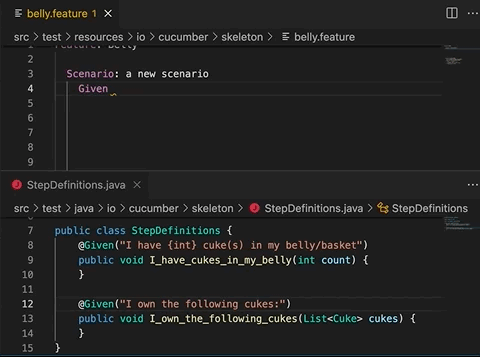
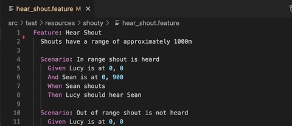
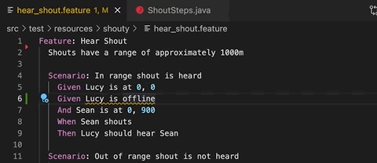
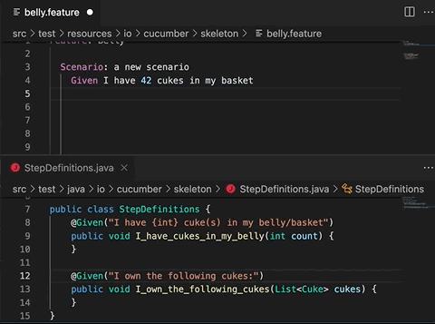
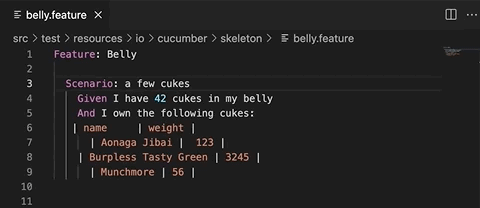

[](https://github.com/cucumber/vscode/actions/workflows/build.yaml)


# Cucumber for Visual Studio Code

This extension adds support for using Cucumber with Visual Studio Code, powered by the [Cucumber Language Server](https://github.com/cucumber/language-server#readme).

This extension is maintained by the [Cucumber team](https://github.com/cucumber/).

# Installation

Get it from the [Open VSX Registry](https://open-vsx.org/extension/CucumberOpen/cucumber-official) or
[Visual Studio Marketplace](https://marketplace.visualstudio.com/items?itemName=CucumberOpen.cucumber-official).

## Features

- [Autocomplete](#autocomplete) of Gherkin steps
- [Go to step definition](#go-to-step-definition)
- [Generate step definition](#generate-step-definition)
- [Syntax highlighting](#syntax-highlighting)
- [Formatting](#formatting) (pretty printing)
- Language support
  - C#
  - [Go/Godog - help needed](https://github.com/cucumber/language-service/issues/72)
  - Java
  - [JavaScript - help needed](https://github.com/cucumber/language-service/issues/42)
  - PHP
  - Python/Behave
  - Ruby
  - [Rust - help needed](https://github.com/cucumber/language-service/issues/82)
  - TypeScript

### Autocomplete



When you start typing a step, you will see auto-complete suggestions
based on existing step definitions and Gherkin steps.

The suggestions are more helpful if your step definitions use
[Cucumber Expressions](https://github.com/cucumber/cucumber-expressions#readme)
but you'll also get suggestions if they use Regular Expressions.

### Go to step definition



You can quickly navigate from a Gherkin step to a step definition.

### Generate step definition



Generate step definition snippets with a quick fix - `⌘` + `.` (MacOS) or
`Ctrl` + `.` (Windows).

*IMPORTANT*: Generate step definition will only be enabled
if there is at least one existing step definition. This is
so that the extension can determine the programming language
for the step definition, and provide choices for existing files
to add it to.

### Syntax highlighting



Gherkin keywords and step parameters are highlighted.
Undefined steps and syntax errors are underlined.

### Formatting



Gherkin documents are formatted using two space indentation. 

Numeric cells are right-aligned (as in Excel). Non-numeric cells are left-aligned.

## Extension Settings

In most cases you shouldn't need to specify any settings
as the extension comes with reasonable defaults. 

If your `.feature` files and step definition files are
in an unconventional file structure, you need to change the
settings to make autocomplete work properly.

### `cucumber.features`
[//]: # (<cucumber.features>)
The `cucumber.features` setting overrides where the extension 
should look for `.feature` files. 

If no feature files are found, [autocomplete](#autocomplete) 
will not work.

Default value:

```json
{
  "cucumber.features": [
    "src/test/**/*.feature",
    "features/**/*.feature",
    "tests/**/*.feature",
    "*specs*/**/.feature"
  ]
}
```
[//]: # (</cucumber.features>)

### `cucumber.glue`
[//]: # (<cucumber.glue>)
The `cucumber.glue` setting overrides where the extension
should look for source code where step definitions and
parameter types are defined.

If no glue files are found, [autocomplete](#autocomplete) 
will not work, and all Gherkin steps will be underlined as 
undefined. [Generate step definition](#generate-step-definition)
will not work either.

Default value:

```json
{
  "cucumber.glue": [
    "src/test/**/*.java",
    "features/**/*.ts",
    "features/**/*.tsx",
    "features/**/*.php",
    "features/**/*.py",
    "tests/**/*.py",
    "features/**/*.rb",
    "*specs*/**/.cs"
  ]
}
```
[//]: # (</cucumber.glue>)

### `cucumber.parameterTypes`
[//]: # (<cucumber.parameterTypes>)
Override the `cucumber.parameterTypes` setting if your Cucumber Expressions
are using [Custom Parameter Types](https://github.com/cucumber/cucumber-expressions#custom-parameter-types) that are defined outside your `cucumber.glue` setting.

Parameter Types in the `cucumber.glue` globs will be picked up automatically.

Default value:

```json
{
  "cucumber.parameterTypes": []
}
```

For example, if you're using the `actor` parameter type from [@cucumber/screenplay](https://github.com/cucumber/screenplay.js#actors) you'll have to declare this in the `parameterTypes` setting:

````json
{
  "cucumber.parameterTypes": [
    { "name": "actor", "regexp": "[A-Z][a-z]+" }
  ]
}
````
[//]: # (</cucumber.parameterTypes>)

## Feedback

If you discover a bug, or have a suggestion for a feature request, please
submit an [issue](https://github.com/cucumber/vscode/issues).
